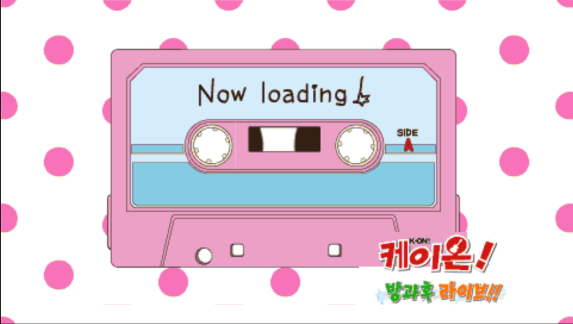
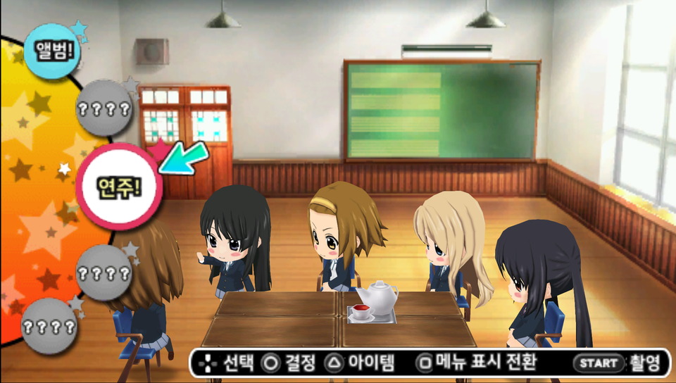
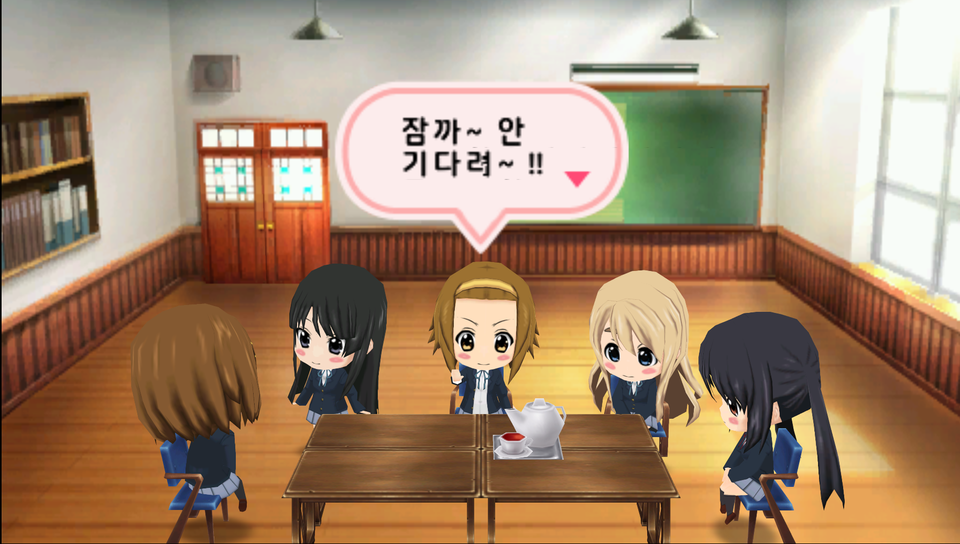
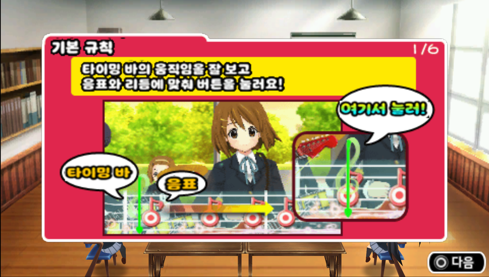
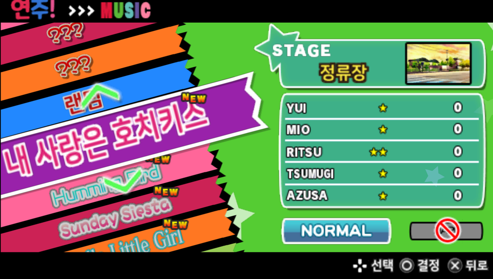
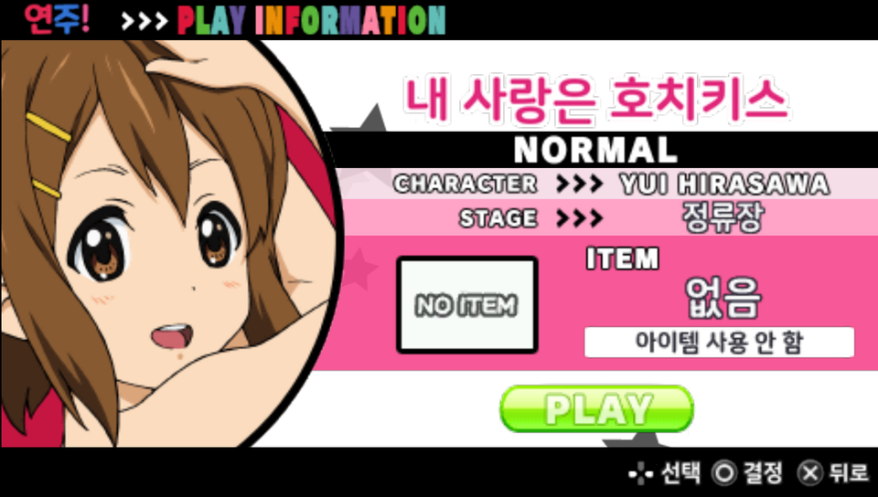

<div align="center">

[](README.md)
[](README.ko.md)

# K-On! Houkago Live!! — Korean Translation Patch

**케이온! 방과후 라이브!! 한국어 패치** · PSP · ULJM05709

[](https://github.com/cailet0422/kon-houkago-live-korean/releases/latest)
[](LICENSE)


**🌸 Download page: https://cailet0422.github.io/kon-houkago-live-korean/**

 

</div>

A full Korean localization of the Japanese PSP rhythm game **K-On! Houkago Live!!** (けいおん! 放課後ライブ!!, Sega, 2010).
All in-game text, menus, tutorials, the title logo and most text textures have been translated.

> [!IMPORTANT]
> This repository does **not** contain the game. You need your own dump of the Japanese UMD
> (`K-On! Houkago Live!! (Japan).iso`). The patch only works on that exact, unmodified ISO.

---

## Contents

- [Screenshots](#screenshots)
- [What is translated](#what-is-translated)
- [Downloads](#downloads)
- [Before you start: check your ISO](#before-you-start-check-your-iso)
- [Step 1 — Apply the patch](#step-1--apply-the-patch)
  - [Windows](#windows-konkopatcherexe)
  - [Android](#android-konkopatcherapk)
  - [macOS / Linux / other (xdelta)](#macos--linux--other-xdelta)
- [Step 2 — Play the game](#step-2--play-the-game)
  - [PSP (real hardware)](#psp-real-hardware)
  - [PS Vita / PS TV (Adrenaline)](#ps-vita--ps-tv-adrenaline)
  - [PPSSPP on Windows / macOS / Linux](#ppsspp-on-windows--macos--linux)
  - [PPSSPP on Android](#ppsspp-on-android)
  - [PPSSPP on iPhone / iPad](#ppsspp-on-iphone--ipad)
  - [Steam Deck](#steam-deck)
- [Important: keep “Install” OFF](#important-keep-install-off)
- [Troubleshooting / FAQ](#troubleshooting--faq)
- [Repository layout](#repository-layout)
- [License](#license)
- [Disclaimer](#disclaimer)

---

## Screenshots

| | |
|:-:|:-:|
|  |  |
| Club room conversation | Tutorial |
|  |  |
| Song select | Play information |

## What is translated

- All in-game text: menus, descriptions, items, costumes, titles (achievements), system messages
- All 49 club-room (tea time) event conversations
- Title logo (also on loading tapes, save icon and the XMB icon), menu labels, all tutorial pages,
  song title cards, album thumbnails, staff roll, props in the club room (posters, signs, blackboard doodles)
- Game title shown in the PSP XMB
- Terminology follows the established Korean K-On! translations (응땅, 기-타, 릿쨩, 아즈냥, 방과후 티타임, 내 사랑은 호치키스 …)

**Intentionally left in Japanese**

- Song lyrics (karaoke subtitles in *Let's Sing!* mode), to match the vocals and respect the lyric copyright
- Real names of general staff in the staff roll, and the copyright notice
- The kana keyboard on the name entry screen

## Downloads

Get the files from the [**latest release**](https://github.com/cailet0422/kon-houkago-live-korean/releases/latest):

| File | For | Notes |
|---|---|---|
| `KonKoPatcher.exe` | Windows 7 or later | One-click GUI patcher (patch data built in) |
| `KonKoPatcher.apk` | Android 5.0 or later | Patch directly on your phone |
| `kon_houkago_live_ko.xdelta` | Any OS | Standard xdelta3 patch |

All three produce exactly the same ISO. You only need **one** of them.

## Before you start: check your ISO

The patch requires the **Japanese** release, as a plain **.iso** (not CSO/CHD/ZSO):

| | |
|---|---|
| File (Redump name) | `K-On! Houkago Live!! (Japan).iso` |
| Game ID | `ULJM-05709` |
| Size | `1,756,659,712` bytes |
| CRC32 | `2F89D4E5` |
| SHA-1 | `7e0120b1557249a3678315d57b72c6fe4cbcfb92` |

The Windows and Android patchers check this automatically. To check by hand:

```powershell
# Windows (PowerShell)
Get-FileHash -Algorithm SHA1 "K-On! Houkago Live!! (Japan).iso"
```
```bash
# macOS
shasum -a 1 "K-On! Houkago Live!! (Japan).iso"
# Linux
sha1sum "K-On! Houkago Live!! (Japan).iso"
```

> [!TIP]
> If your copy is a **.cso**, decompress it back to .iso first (e.g. `maxcso --decompress game.cso`).
> CSO compression is lossless, so the hash will match again.
> If you dumped the UMD yourself and the hash still differs, the dump is probably bad — dump it again.

After patching, the result is the same size as the original and has
SHA-1 `ffa313fb7a3f3567995ebf9e91ca63cb9100d2d6`.

## Step 1 — Apply the patch

You need about **1.8 GB** of free space for the patched ISO. The original file is never modified.

### Windows (`KonKoPatcher.exe`)

1. Download `KonKoPatcher.exe` and put it anywhere.
2. Run it. If Windows SmartScreen shows *“Windows protected your PC”*, click **More info → Run anyway**
   (the program is not code-signed).
3. Click **찾아보기...** (Browse) and choose the original ISO — or simply **drag the ISO onto the window**
   (or onto the `.exe` icon).
4. Click **패치** (Patch). The patcher will
   1. verify the original ISO (size + SHA-1),
   2. apply the patch,
   3. verify the result.
5. When **완료!** (Done) appears, `K-On_Houkago_Live_KO.iso` has been created **in the same folder as the original ISO**.

Requires .NET Framework 4 (pre-installed on Windows 8 and later; on Windows 7 install it from Microsoft if missing).

### Android (`KonKoPatcher.apk`)

1. Download `KonKoPatcher.apk` on your phone.
2. Open it and install. If asked, allow **Install unknown apps** for your browser / file manager.
3. Copy the original ISO to the phone (internal storage or SD card) if it is not there yet.
4. Open **케이온! 한국어 패치**.
5. Tap **원본 ISO 선택** (Select original ISO) and pick the ISO.
6. Tap **패치** (Patch), then choose where to save the result and its file name
   (e.g. `Download/K-On_Houkago_Live_KO.iso`).
7. Wait until **완료!** (Done) appears — usually 1–5 minutes. **Do not close the app while patching.**

The patched ISO can be opened directly in PPSSPP for Android (see below).

### macOS / Linux / other (xdelta)

Use any xdelta3 tool with `kon_houkago_live_ko.xdelta`.

**Command line**

```bash
# macOS:  brew install xdelta
# Debian/Ubuntu:  sudo apt install xdelta3
# Fedora:  sudo dnf install xdelta
xdelta3 -d -s "K-On! Houkago Live!! (Japan).iso" kon_houkago_live_ko.xdelta "K-On_Houkago_Live_KO.iso"
```

On Windows you can do the same with `xdelta3.exe`.

**GUI** — any xdelta front-end works, for example *Delta Patcher* (Windows/macOS/Linux) or *xdelta UI*:

1. Original file → the Japanese ISO
2. Patch / XDelta file → `kon_houkago_live_ko.xdelta`
3. Output → `K-On_Houkago_Live_KO.iso`
4. Apply / Patch

If xdelta reports a *checksum* or *source* error, your ISO is not the expected one — see [Check your ISO](#before-you-start-check-your-iso).

## Step 2 — Play the game

### PSP (real hardware)

Works on PSP-1000 / 2000 / 3000 / E1000 (Street) / N1000 (Go) running **custom firmware**
(for example [ARK-4](https://github.com/PSP-Archive/ARK-4), PRO-C or LME on firmware 6.60/6.61).
Installing CFW itself is outside the scope of this guide — follow the instructions of the CFW you use.

1. Connect the PSP to your computer (**Settings → USB Connection**) or insert the Memory Stick into a card reader.
2. Copy `K-On_Houkago_Live_KO.iso` into the **`ISO`** folder at the root of the Memory Stick
   (create the folder if it does not exist):
   ```
   ms0:/ISO/K-On_Houkago_Live_KO.iso      ← Memory Stick (PSP-1000/2000/3000/E1000, or the Go's M2 card)
   ef0:/ISO/K-On_Houkago_Live_KO.iso      ← PSP Go internal storage
   ```
   The ISO is 1.76 GB, so a Memory Stick of **2 GB or more** (FAT32) is required.
3. Disconnect USB, then go to **Game → Memory Stick** in the XMB.
   The game appears as **케이온! 방과후 라이브!!** with the Korean icon.
4. Start the game. **Make sure “Install” stays OFF** in the in-game settings (see [below](#important-keep-install-off)).

If the game does not start or freezes, open your CFW's VSH menu (usually **SELECT** in the XMB),
switch the **ISO driver** (e.g. Inferno ↔ NP9660 / M33), and try again.

Your existing Japanese save data is compatible and can be used as is.

> [!NOTE]
> Development and testing were done mainly in PPSSPP. If you play on real hardware,
> please report your results (good or bad) in [Issues](https://github.com/cailet0422/kon-houkago-live-korean/issues).

### PS Vita / PS TV (Adrenaline)

Requires a hacked Vita/PS TV with [Adrenaline](https://github.com/TheOfficialFloW/Adrenaline) (PSP CFW running inside the Vita).

1. Copy `K-On_Houkago_Live_KO.iso` to **`ux0:pspemu/ISO/`** — via VitaShell's USB or FTP mode
   (create the `ISO` folder if needed).
2. Launch **Adrenaline**, go to **Game → Memory Stick** in the PSP XMB and start the game.
3. Keep **Install OFF** in the in-game settings.

Behaves the same as a real PSP.

### PPSSPP on Windows / macOS / Linux

1. Install PPSSPP from [ppsspp.org](https://www.ppsspp.org/download/) (tested with **v1.20**; recent versions are recommended).
   - Linux: also available on Flathub (`org.ppsspp.PPSSPP`).
2. Start PPSSPP and click **Load...**, then select `K-On_Houkago_Live_KO.iso`.
   Alternatively, browse to the folder in the **Games** tab and set it as home so it shows up every time.
3. Default settings work fine. Optional tips:
   - **Settings → System → Language → 한국어** to show PPSSPP's own menus in Korean.
   - **Settings → Graphics → Rendering resolution** 2× or higher makes the Korean text sharper.
   - Avoid texture *upscaling* filters (xBRZ etc.); they can make small Korean text blurry.
4. Keep **Install OFF** in the in-game settings.

Existing Japanese PPSSPP save data (in `memstick/PSP/SAVEDATA`) works with the Korean version.
**Save states made before patching** still contain the old (Japanese) textures in RAM — start the game from boot and use the in-game save instead.

### PPSSPP on Android

1. Install **PPSSPP** from Google Play (or the APK from ppsspp.org).
2. Put the patched ISO somewhere on the phone — if you used `KonKoPatcher.apk`, it is already where you saved it
   (e.g. `Download`). A dedicated folder such as `PSP/GAME` keeps things tidy.
3. In PPSSPP, open the **Games** tab, browse to that folder (grant storage access when asked) and tap the game.
   Tip: use **Home** (house icon) to remember the folder.
4. Keep **Install OFF** in the in-game settings.

### PPSSPP on iPhone / iPad

1. Install **PPSSPP** from the App Store.
2. Patch the ISO on a computer or Android device (iOS has no patcher app),
   then transfer it to the device — e.g. Finder/iTunes file sharing, AirDrop, or a cloud drive —
   into **Files → On My iPhone/iPad → PPSSPP**.
3. In PPSSPP, browse to that folder and start the game.
4. Keep **Install OFF** in the in-game settings.

### Steam Deck

1. Install PPSSPP: Desktop Mode → **Discover → PPSSPP**, or via EmuDeck.
2. Patch the ISO on another computer (Windows/macOS/Linux) and copy it to the Deck
   (EmuDeck users: `Emulation/roms/psp/`).
   You can also patch on the Deck itself with `xdelta3` if you have it installed.
3. Start the game in PPSSPP (or through Steam ROM Manager if you use EmuDeck). Keep **Install OFF**.

## Important: keep “Install” OFF

In the in-game **설정!** (Settings) menu there is an **인스톨** (Install) option that copies data to the Memory Stick for faster loading.
To keep the patched ISO the same size as the original, the install data file inside the ISO had to be emptied.
**If you turn Install ON, the game will not work correctly.** It is OFF by default — just leave it that way.

## Troubleshooting / FAQ

<details>
<summary><b>The patcher says “원본 ISO가 아닙니다” (not the original ISO) / xdelta fails</b></summary>

Your file is not the expected Japanese ISO: it may be already patched, a CSO, a different region/version,
or a bad dump. Check the size and SHA-1 in [Check your ISO](#before-you-start-check-your-iso).
</details>

<details>
<summary><b>Some text is still Japanese</b></summary>

Song lyrics, the name-entry kana keyboard, staff names and the copyright line are left in Japanese on purpose.
If you find anything else, please open an issue with a screenshot.
</details>

<details>
<summary><b>I see Japanese textures in PPSSPP even though I patched</b></summary>

You probably loaded a save state made with the Japanese ISO. Save states store textures in memory —
boot the game normally and load your in-game save.
</details>

<details>
<summary><b>Can I keep my Japanese save data?</b></summary>

Yes. The save format is unchanged; continue from your existing save.
</details>

<details>
<summary><b>Can I compress the patched ISO to CSO?</b></summary>

Usually yes (e.g. with maxcso), but CSO has not been tested with this patch. If you see problems, use the plain ISO.
</details>

## Repository layout

This repository holds the tools used to build the patch and the Korean translation data. It is published for reference;
building the patch yourself requires the original game, and files that contain game content
(original-text dumps, extracted/edited textures, ISOs) are not included.

| Path | Contents |
|---|---|
| `text/` | Korean translations (KKS scripts, EBOOT strings, tea-time events) |
| `assets_src/` | Specs for relabeled textures (labels, fonts, positions) |
| `tools/` | Python build pipeline: CPK/CRILAYLA, EBOOT relocation, UVR/GIM textures, font atlas, ISO rebuild, patch maker |
| `tables/` | Character table |
| `work/` | One-off image generation scripts (logo, staff roll, tutorials …) |
| `patcher/` | Windows GUI patcher (C#, .NET Framework 4) and Android patcher (Java) |

Main entry points: `tools/build.py` (builds the Korean ISO) and `tools/release.py` (makes the xdelta, EXE and APK).

## License

The tools, patcher source code and Korean translation in this repository are released under the [MIT License](LICENSE).
*K-On!* and *K-On! Houkago Live!!* themselves, and all original game content, belong to their respective rights holders and are **not** covered by this license.

## Disclaimer

This is an unofficial fan translation made for personal enjoyment. It is not affiliated with or endorsed by
Sega, Kyoto Animation or any other rights holder of *K-On!*.
No game data is distributed — please own the original game. Use at your own risk.
